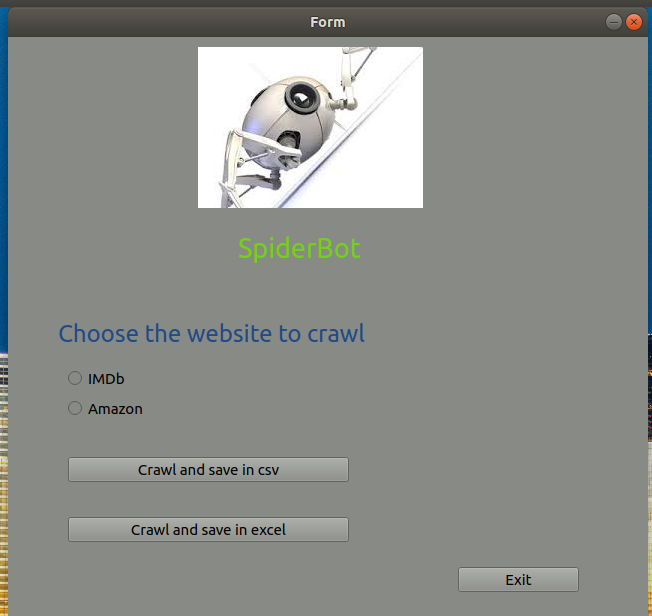
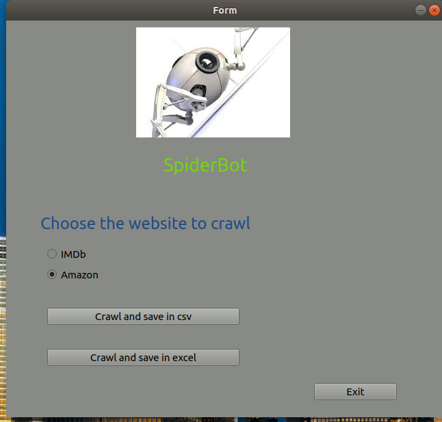
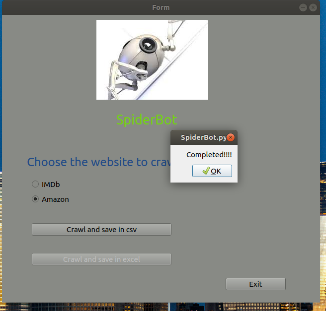

# SpiderBot

<p>A GUI based Web Scrapper.</p>


---

## Table of Contents
---

* [Description](#description)
* [Technologies](#technologies)
* [Setup](#setup)

---


## Description
---
* This is a GUI based web Scrapper which provides us two options: To scrap data from Amzon or To scrap data from IMDb

* From Amazon it scraps the details of 100 best sold books
* From IMDb it scraps the details of all celebrites.
* After scrapping it provides us to save the data in two formats- CSV file or Excel file


**ScreenShots**

---
<p> This screen will show on running SpiderBot.py </p>



---
<p> Here select the required website </p>
<p> Then click on desired button</p>

---


<p>Wait for this completion alert</p>
<p>click on ok</p>
<p>Then click on Exit button</p>
## Technologies
---
* Python 3.x
* PyQt5
* BeautifulSoup
* Regex
---


## Setup
---
<p> Download the project in a folder</p>
<p> Then for dependecies</p>

```
pip install requirements.txt
```

<p>If above doesn't works</p>

```
pip3 install reqirements.txt
```
<p>For running the app run SpiderBot.py</p>

```
python SpiderBot.py
```
or
```
python3 SpiderBot.py
```
